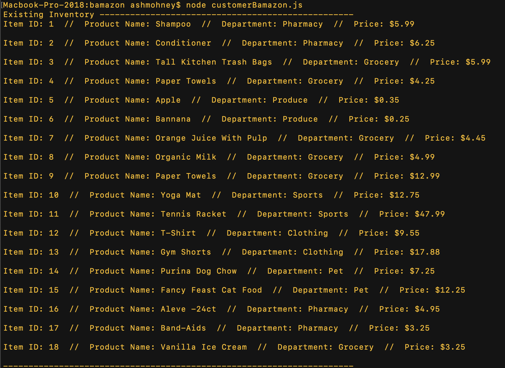
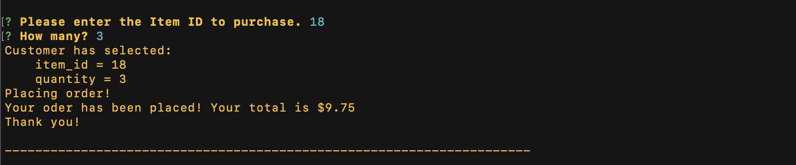
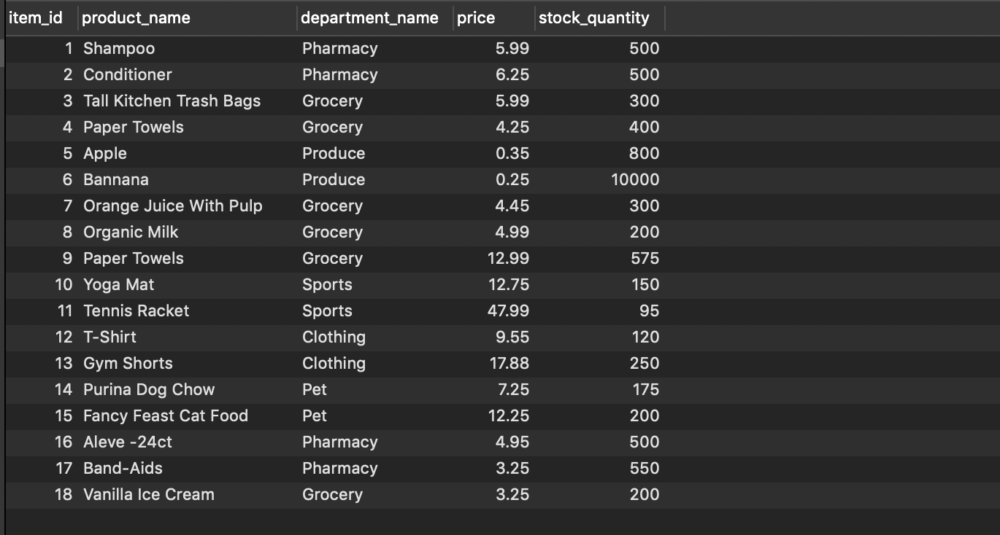
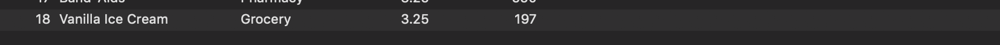
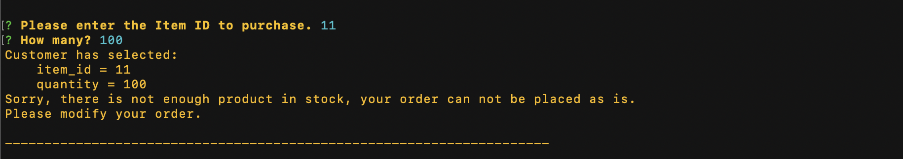

# bamazon
CLI shopping app where MySQL and Node.JS are used to allow users to purchase items. 
#
The Bamazon customer app allows the user to choose an item from the inventory available:

The user will choose an item and type in the Item ID. Then, the user will be asked to enter a quantity. The app will automatically calculate the cost and thank the user. 

#

Since the order was successful, MySql will track the difference in quanity through the database. 

### Database Before Transaction

### Databse Updated After Transaction

#
Otherwise, there is a notice if there insufficient quanitity.

